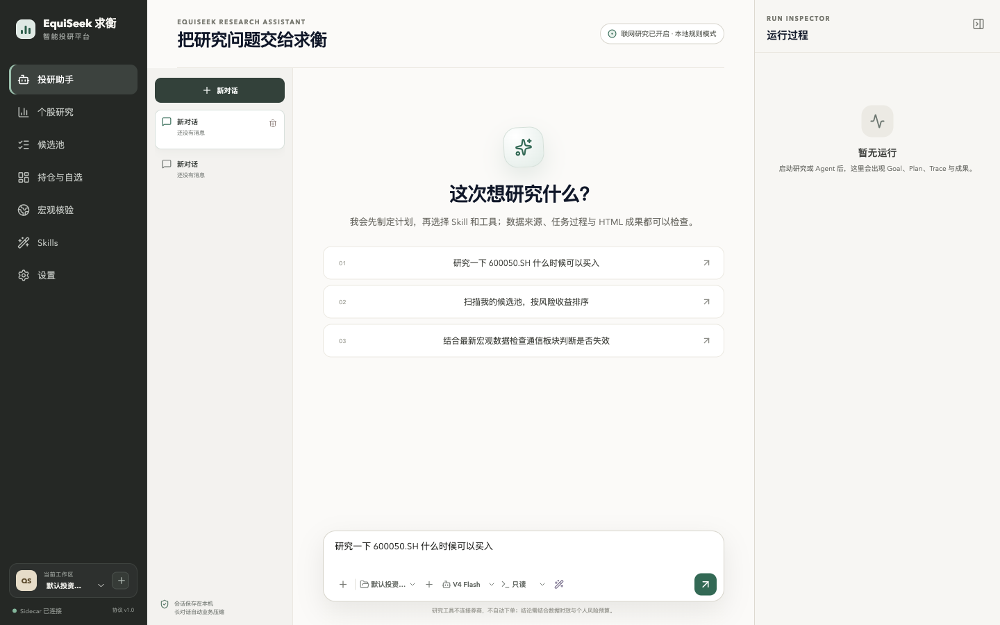
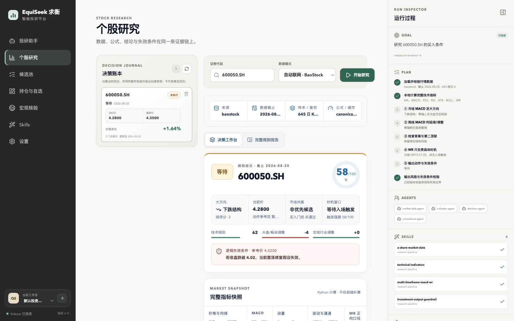

# EquiSeek 求衡

English | [简体中文](README.zh-CN.md)

> Seek Evidence. Balance Risk. Shape Decisions.

EquiSeek is a local-first, open-source AI investment research platform for individual investors. It brings the research assistant, stock and macro research, portfolio and watchlist management, reusable Skills, recoverable Goals and Plans, workspace tools, and auditable run traces into one desktop application.

The current desktop product is the light-themed Electron application under `apps/desktop`. It does not require an account, connect to a brokerage, place orders, or promise returns.

> **Desktop scope:** the public project contains one desktop client: the Electron application under `apps/desktop`. Python provides its sidecar and reusable research engine, not a second desktop UI.

## Highlights

- Research assistant: persistent conversations, Markdown/HTML artifacts, attachments, Goals, Plans, sub-agents, and run traces.
- Stock research: locally calculated MA, MACD, KDJ, RSI, ATR, BOLL, and WR indicators, with multi-timeframe rules, data freshness, triggers, invalidation conditions, and traceable reports.
- Decision journal: successful stock-research conclusions remain local and replayable, with optional same-source closing-price follow-up clearly labeled as hypothetical rather than actual trading performance.
- Macro research: discovery and verification of official releases, with freshness gates before capital-flow, cost-transfer, allocation, or sector conclusions are updated.
- Portfolio and watchlist: query and maintain local positions and candidates through either the interface or the research assistant.
- Workspaces and Skills: persistent shell and permission-controlled file tools inside an explicitly selected workspace; built-in Skills can be viewed, enabled, overridden, or extended.
- Optional models: deterministic local research works without an API key; DeepSeek or an OpenAI-compatible provider can be configured when language reasoning is needed.
- Agent harness: recoverable runs, a persistent DAG, approvals, tool permissions, idempotent side effects, event replay, artifacts, isolated workspaces, and deterministic evaluations.

## Interface preview

### Research assistant



### Stock research and decision journal



## Quick start

| Goal | Command | PostgreSQL required |
| --- | --- | --- |
| Start the current desktop app | `make desktop-install && make desktop` | No |
| Build the current desktop app | `make desktop-build` | No |
| Create current-platform desktop packages | `make desktop-package` | No |
| Start the local API and worker | `make local-api` / `make local-worker` | No, SQLite by default |
| Run the local harness demo | `make bootstrap && make demo-fake` | No |
| Run a multi-worker deployment | `make up` | Yes, started by Docker Compose |

## Run the desktop app from source

### Requirements

- macOS or Windows
- Python 3.12
- [uv](https://docs.astral.sh/uv/)
- Node.js 24 (Node.js 22 or newer also works) and npm
- Network access when dependencies are installed for the first time

On macOS or Linux:

```bash
git clone https://github.com/Bruce7777/EquiSeek.git
cd EquiSeek
make desktop-install
make desktop
```

`make desktop-install` installs both the Python sidecar and Electron dependencies. Normal development runs only need `make desktop` afterward.

On Windows PowerShell:

```powershell
uv sync --frozen --extra desktop-build --extra dev
npm ci --prefix apps/desktop
$env:EQUISEEK_REPO_ROOT = (Get-Location).Path
$env:EQUISEEK_PYTHON = "$env:EQUISEEK_REPO_ROOT\.venv\Scripts\python.exe"
npm --prefix apps/desktop run dev
```

## Build the desktop app

Create an unsigned, unpacked application for the current platform:

```bash
make desktop-install
make desktop-build
```

Build output is written to `apps/desktop/out/`. A typical macOS path is:

```text
apps/desktop/out/EquiSeek-darwin-*/EquiSeek.app
```

Create the current platform's unsigned test packages:

```bash
make desktop-package
```

Artifacts are written under `apps/desktop/out/make/`: an unsigned ZIP on macOS and an unsigned Squirrel Setup.exe on Windows. The PyInstaller sidecar and Electron app must be built natively on each target architecture.

## Download and install the unsigned Alpha

Non-developer testers can download the current prebuilt Alpha from [GitHub Releases](https://github.com/Bruce7777/EquiSeek/releases/tag/v0.2.0-alpha.5). A valid Alpha Release must contain all three assets plus `SHA256SUMS`:

| Platform | Asset |
| --- | --- |
| Apple Silicon Mac | [Download arm64 ZIP](https://github.com/Bruce7777/EquiSeek/releases/download/v0.2.0-alpha.5/EquiSeek-macOS-arm64-0.2.0-alpha.5-unsigned.zip) |
| Intel Mac | [Download x64 ZIP](https://github.com/Bruce7777/EquiSeek/releases/download/v0.2.0-alpha.5/EquiSeek-macOS-x64-0.2.0-alpha.5-unsigned.zip) |
| Windows 10/11 x64 | [Download x64 Setup.exe](https://github.com/Bruce7777/EquiSeek/releases/download/v0.2.0-alpha.5/EquiSeek-Windows-x64-0.2.0-alpha.5-unsigned-Setup.exe) |

If the Releases page has no matching assets, the build has not completed—do not download an arbitrary source archive and treat it as an installer. These Alpha packages are not signed or notarized: macOS Gatekeeper and Windows SmartScreen can warn or block them, antivirus software may inspect the bundled Python sidecar, and managed devices may forbid installation completely. Download only from this repository, verify `SHA256SUMS`, and follow the [unsigned desktop installation guide](docs/installing-unsigned-desktop.md). A signed stable release can be added after certificates are available; see [Desktop releases](docs/releasing-desktop.md).

To build without Make:

```bash
cd packaging
uv run pyinstaller --noconfirm --clean --distpath ../dist --workpath ../build EquiSeekSidecar.spec
cd ..
npm --prefix apps/desktop run package
```

## Run the local API and worker

A single-user local installation uses SQLite/WAL and does not require PostgreSQL or Docker:

```bash
make bootstrap
make local-init
make local-api
```

In another terminal:

```bash
make local-worker
```

- Main database: `~/.equiseek/user-data/equiseek.sqlite3`
- LangGraph checkpoints: `~/.equiseek/user-data/equiseek-checkpoints.sqlite3`

PostgreSQL is intended for multiple users, competing workers, or server deployments:

```bash
make up
curl -s http://127.0.0.1:8000/health
```

## Run the agent harness demo

```bash
make bootstrap
make demo-fake
open .equiseek/demo-report.html   # macOS
make test
```

The fake model is a repeatable release baseline that needs no external model credentials. API requests enqueue runs; a worker must also be running to execute them.

## Data, models, and security boundaries

- Without a model API key, the desktop app runs only transparent fixed-rule analysis; it does not call or imitate an LLM. The composer shows this state and links directly to Settings. Configure your own DeepSeek or compatible-provider key for dynamic language understanding and answers.
- BaoStock supplies public historical market data without a token. Tushare is a separate optional source and requires its own token.
- Current stock research covers mainland China A-shares plus supported domestic indices and funds. US, Hong Kong, Japanese and European equities, global indices, foreign exchange, futures, and crypto assets are not yet connected.
- Macro research verifies official web pages. On network failure it can only fall back to the latest complete local snapshot and must display its freshness and invalidation state.
- DeepSeek, Tushare, Tavily, and other credentials are independent. Available models depend on the configured provider and endpoint.
- User data defaults to `~/.equiseek/user-data`; override it with `EQUISEEK_USER_DATA_ROOT`.
- Shell and file tools operate only inside the workspace selected by the user. On macOS, Seatbelt is used for isolation; execution is denied when required isolation is unavailable.
- A workspace is a permission and audit boundary, not a complete virtual-machine sandbox for hostile multi-tenant workloads.

## Skills and workspaces

User Skills are stored under:

```text
~/.equiseek/user-data/skills/<skill-name>/SKILL.md
```

Use the desktop Skill manager to import, inspect, edit, enable, or disable a Skill. You can also install the example manually:

```bash
mkdir -p ~/.equiseek/user-data/skills
cp -R examples/user-skills/steady-long-term ~/.equiseek/user-data/skills/
```

A Skill can orchestrate authorized tools but cannot expand file, shell, network, or market-evidence permissions. Each run records the Skills used, tool parameter summaries, data sources, freshness, plan state, and artifacts. Traces are auditable process summaries and do not expose a model's hidden chain of thought.

## Brand and migration compatibility

The project and product are named **EquiSeek / 求衡**. New user-facing commands use `equiseek`. Earlier command names and local data locations remain readable as migration aliases, so an upgrade does not discard existing data or scripts.

The two README files carry equal authority. After changing either one, update its counterpart and refresh the pairing record:

```bash
python scripts/verify_readme_pair.py --write
python scripts/verify_readme_pair.py
```

## Testing

Current Electron desktop path:

```bash
make docs-check
make desktop-smoke
make desktop-package
```

Python harness:

```bash
make lint
make typecheck
make test
make test-fault
```

## Documentation

- [Desktop usage and research methodology](docs/desktop.md)
- [Local and server quick start](docs/quickstart.md)
- [Agent orchestration, workspaces, and sandboxing](docs/orchestration.md)
- [Architecture boundaries](docs/architecture.md)
- [Macro research methodology and official sources](docs/macro-analysis.md)
- [Stock, market, and sector confluence](docs/market-sector-confluence.md)
- [Threat model](docs/threat-model.md)
- [Evaluation and release gates](docs/evaluation.md)
- [Responsible use and regulatory boundaries](docs/responsible-use.md)

## License and responsible use

Licensed under [Apache-2.0](LICENSE). The repository contains no code, prompts, schemas, data, or business processes belonging to an employer.

EquiSeek is intended for investment research and software-engineering reference. It is not a promise of returns. Open-source or local operation does not automatically exempt an operator from securities-investment-advisory regulation. Before offering paid public access or personalized recommendations about specific securities, independently assess licensing, market-data rights, suitability, record keeping, privacy, AI-service governance, and marketing requirements.
